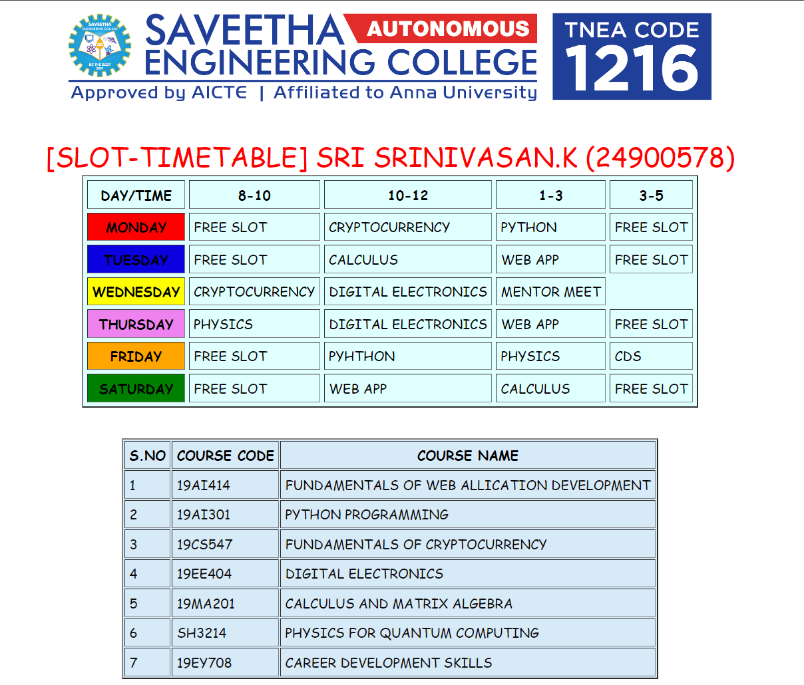

# Ex03 Time Table
## Date:17/11/2024

## AIM
To write a html webpage page to display your slot timetable.

## ALGORITHM
### STEP 1
Create a Django-admin Interface.

### STEP 2
Create a static folder and inert HTML code.

### STEP 3
Create a simple table using ```<table>``` tag in html.

### STEP 4
Add header row using ```<th>``` tag.

### STEP 5
Add your timetable using ```<td>``` tag.

### STEP 6
Execute the program using runserver command.

## PROGRAM
```
<html>
    <title>TIMETABLE</title>
    <HEAD>
        <link rel="STYLESHEET" href="STYLE1.CSS" TYPE="TEXT/CSS">
    </HEAD>
    <header></header>
    <BR>
        <BR>
    <body ALIGN="CENTER" BGCOLOR="WHITE"><FONT SIZE="6" COLOR="RED" FACE="CURSIVE">[SLOT-TIMETABLE] SRI SRINIVASAN.K (24900578)</FONT>    
    <table BORDER="2" CELLPADDING="5" CELLSPACING="5" align="CENTER" BGCOLOR="#e0ffff" >
        <tr>
            <th><FOnt COLOR="BLACK" FACE="CURSIVE">DAY/TIME</FOnt></th>
            <th><FOnt COLOR="BLACK" FACE="CURSIVE">8-10</FOnt></th>
            <TH><FOnt COLOR="BLACK" FACE="CURSIVE">10-12</FOnt></TH>
            <TH><FOnt COLOR="BLACK" FACE="CURSIVE" >1-3</FOnt></TH>
            <TH><FOnt COLOR="BLACK" FACE="CURSIVE">3-5</FOnt></TH>
        </tr>
        <TR>
            <TH BGCOLOR="RED">MONDAY</TH>
            <TD>FREE SLOT</TD>
            <TD><FONT COLOR="BLACK" FACE="CURSIVE">CRYPTOCURRENCY</FONT></TD>
            <TD><FONT COLOR="BLACK" FACE="CURSIVE">PYTHON</FONT></TD>
            <TD>FREE SLOT</TD>
        </TR>
        <TR>
            <TH bgcolor="=BLUE">TUESDAY</TH>
            <TD>FREE SLOT</TD>
            <TD><FONT COLOR="BLACK" FACE="CURSIVE">CALCULUS</FONT></TD>
            <TD><FOnt COLOR="BLACK" FACE="CURSIVE">WEB APP</FONT></TD>
            <TD>FREE SLOT</TD>
        </TR>
        <TR>
            <TH bgcolor="YELLOW">WEDNESDAY</TH>
            <TD><FOnt COLOR="BLACK" FACE="CURSIVE">CRYPTOCURRENCY</FONT></TD>
            <TD><FONT COLOR="BLACK" FACE="CURSIVE">DIGITAL ELECTRONICS</FONT></TD>
            <TD><FOnt COLOR="BLACK" FACE="CURSIVE">MENTOR MEET</FOnt></TD>
        <TR>
            <TH bgcolor="VIOLET">THURSDAY</TH>
            <TD><FOnt COLOR="BLACK" FACE="CURSIVE">PHYSICS</FOnt></TD>
            <TD><FOnt COLOR="BLACK" FACE="CURSIVE">DIGITAL ELECTRONICS</FOnt></TD>
            <TD><FOnt COLOR="BLACK" FACE="CURSIVE">WEB APP</FOnt></TD>
            <TD>FREE SLOT</TD>
        </TR>
        <TR>
            <TH bgcolor="ORANGE">FRIDAY</TH>
            <TD>FREE SLOT</TD>
            <TD><FOnt COLOR="BLACK" FACE="CURSIVE">PYHTHON</FOnt></TD>
            <TD><FOnt COLOR="BLACK" FACE="CURSIVE">PHYSICS</FOnt></TD>
            <TD><FOnt COLOR="BLACK" FACE="CURSIVE">CDS</FOnt></TD>
        </TR>
        <TR>
            <TH bgcolor="GREEN">SATURDAY</TH>
            <TD>FREE SLOT</TD>
            <TD><FOnt COLOR="BLACK" FACE="CURSIVE">WEB APP</FOnt></TD>
            <TD><FOnt COLOR="BLACK" FACE="CURSIVE">CALCULUS</FOnt></TD>
            <TD>FREE SLOT</TD>
        </TR>
    </table>
    <BR>
    <BR>
    <table border="2" cellpadding="5"  align="center" BGCOLOR="#d6eaf8">
            <tr>
                <th>S.NO</th>
                <th>COURSE CODE</th>
                <TH>COURSE NAME</TH>
            </tr>
            <TR>
                <TD>1</TD>
                <TD>19AI414</TD>
                <TD>FUNDAMENTALS OF WEB ALLICATION DEVELOPMENT</TD>
            </TR>
            <TR>
                <TD>2</TD>
                <TD>19AI301</TD>
                <TD>PYTHON PROGRAMMING</TD>
            </TR>
            <TR>
                <TD>3</TD>
                <TD>19CS547</TD>
                <TD>FUNDAMENTALS OF CRYPTOCURRENCY</TD>
            </TR>
            <TR>
                <TD>4</TD>
                <TD>19EE404</TD>
                <TD>DIGITAL ELECTRONICS</TD>
            </TR>
            <TR>
                <TD>5</TD>
                <TD>19MA201</TD>
                <TD>CALCULUS AND MATRIX ALGEBRA</TD>
            </TR>
            <TR>
                <TD>6</TD>
                <TD>SH3214</TD>
                <TD>PHYSICS FOR QUANTUM COMPUTING</TD>
            </TR>
            <TR>
                <TD>7</TD>
                <TD>19EY708</TD>
                <TD>CAREER DEVELOPMENT SKILLS</TD>
            </TR>
        </table>
    </BODY>
</html>
```

## OUTPUT



## RESULT
The program for creating slot timetable using basic HTML tags is executed successfully.
